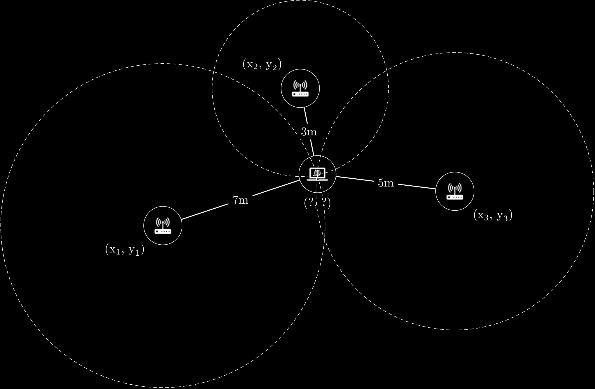

# Wi-Fi Positioning App
Wi-Fi positioning system that approximates user device location on a map using signal strength from nearby Wi-Fi access points.



## Motivation
Walking around campus where there are wifi hotspots located everywhere, I wanted to know if there was a way to determine how close you were in relation to nearby Wi-Fi access points based solely on signal strength. The stronger the signal, the closer you should be, right? Well, while the relationship may not be direclty proportional, there is a relationship! Furthermore, I thought, if there is a relationship between signal strength and distance, could I use this signal data to triangulate my position relative to nearby access points? Thus birthed the idea for this project. I wanted to test the possibility of implementing my own Wi-Fi positioning system at my college where the only technology available to me would be the various access points scattered throughout campus.

## Method
There are many ways to implement a Wi-Fi positioning system. As I was required to use only the technologies available to me already on campus, my approach relied heavily on access point signal strength:
1. Gather data for initial setup
   - Exact latitude & longitude coordinates of APs across campus, collected with phone GPS
   - Exact latitude & longitude coordinates of the corners of campus map
2. Scan for nearby AP data using Windows WLAN API
   - RSSI (received signal strength indicator)
   - BSSID (mac address)
   - SSID (network name)
3. Use AP data to calculate relative distance
   - Convert RSSI into approximate distance using the Free Space Path Loss (FSPL) formula
   - Define coordinate plane of college map by converting latitude/longitude coordinates into metric units
4. Approximate user device location using Wi-Fi trilateration
   - Produce one cricle around each AP with radius equal to the distance from the AP to the user's device
   - Given a minimum of 3 APs, user device location can be found at the intersection of the circles they create
  
## Installation
1. Clone the repository:
   ```
   git clone https://github.com/mctripp10/wi-fi-positioning-app.git
   ```
   
2. Navigate to project directory
   ```
   cd wi-fi-positioning-app
   ```
   
3. Install libraries
   ```bash
   pip install numpy
   pip install matplotlib
   ```

## Use Your Own Map
If you would like to try implementing this WPS yourself at another location, navigate to ```wifi_positioning_app.py``` and configure the following settings:
1. Upload picture of your location's map to ```map_img_path``` - must fit latitude/longitude range you wish to use perfectly
2. Record BSSID and latitude/longitude coordinates of at least 3 nearby Wi-Fi access points in ```known_APs``` (must be within the range of your map) 
3. Record latitude/longitude coordinates of the top left and bottom right corner of your map in ```top_left_corner``` and ```bottom_right_corner```

## Results
Unfortunately, this project did not yield the desired results in accuracy as the phone GPS was not accurate enough to record hotspot locations. The FSPL formula also likely needed to be refined to be more accurate, perhaps with the aid of location fingerprinting. Given a technology like a dedicated GPS device to log hotspot positions more accurately and the time to implement fingerprinting, however, I believe this system has a high liklihood of success.

For discussion of results and implementation, please see ```./docs/analysis_and_discussion.pdf```
